# Optimizing Reinforcement Learning for a Platformer Game Using Unity ML-Agents

## Background

The Unity ML-Agents package is a toolkit to facilitate the training of artificial agents in simulated environments within the Unity game engine. It supports Deep Reinforcement Learning (DRL), an advanced subset of reinforcement learning where deep neural networks are used to approximate complex policies and value functions. DRL combines the decision-making framework of reinforcement learning with the power of deep learning to handle high-dimensional state and action spaces. This allows agents to learn complex behaviors and strategies through training in different environments, making it suitable for robotic applications.

## Simulation Overview

This simulation was developed for the purpose of practicing with the Unity ML-Agents package and the Reinforcement Learning paradigm. The game environment consists of a single cube (the agent), three pillars (platforms), surrounding walls, and a goal object. The objective is to train the agent to reach the goal by climbing to the top.

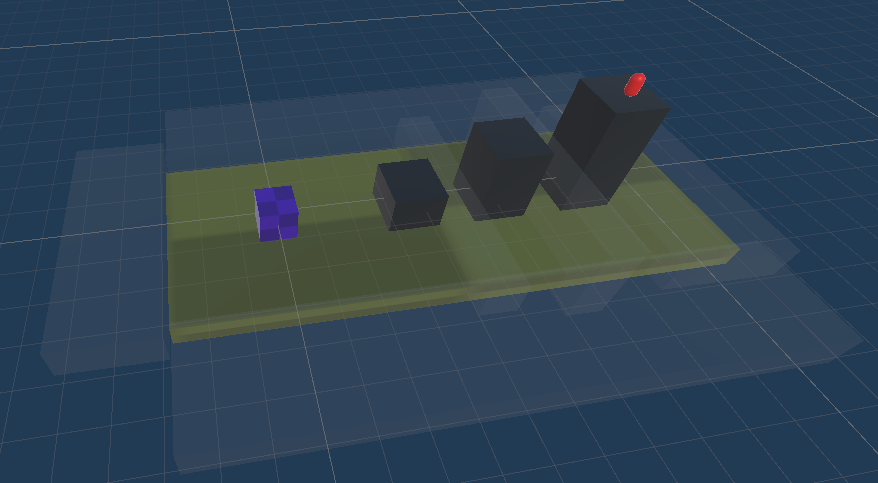
*fig1:Game environment*

## Rewards and Penalties

To encourage exploration while preventing completely random actions, rewards and penalties needed to be defined carefully. In the earlier iterations of the environment, a single reward was defined (+1.0), which was earned by reaching on top of the third pillar. A penalty of -1.0 point was deducted for collisions with the walls.

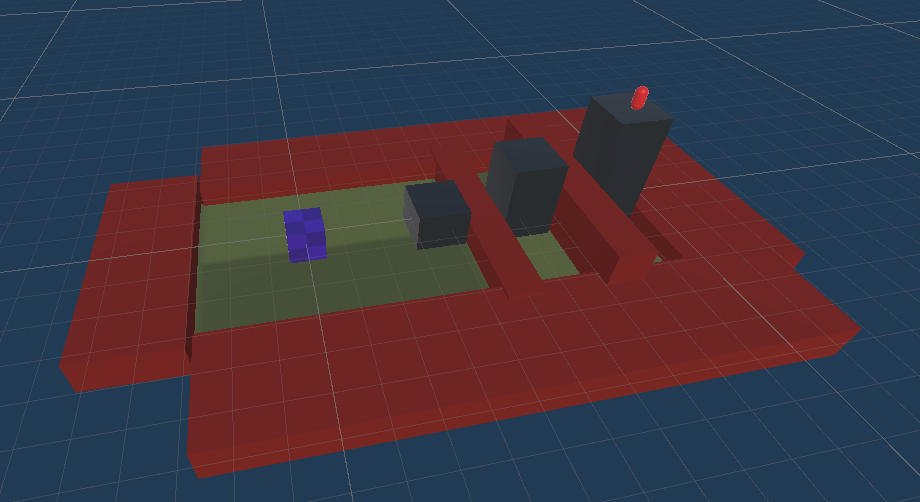
*fig2*

## Action and Observation Space

The agent’s observation space consists of six floating-point numbers representing the x, y, and z coordinates of the agent and the goal. The action space includes two continuous dimensions for movement along the x and z axes, with values ranging from [-1,1], and one discrete action with a size of 2, representing "jump" or "don't jump" actions.

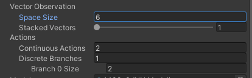
*fig3:*

## Training

During the training phase, multiple agents were trained in parallel within identical environments to reduce the overall training duration. Initially, 20 environments were used, which was later increased to 120 environments in the following iterations.

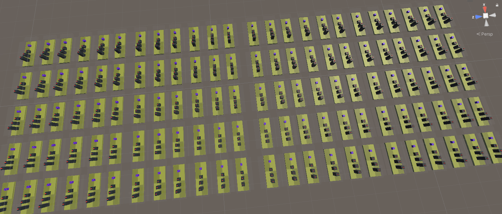

Training with the initial environment resulted in poor results, as the agents mostly focused on avoiding collisions with the walls rather than going for the reward. Consequently, the model became stuck at a local minimum, and the cumulative reward converged to 0.

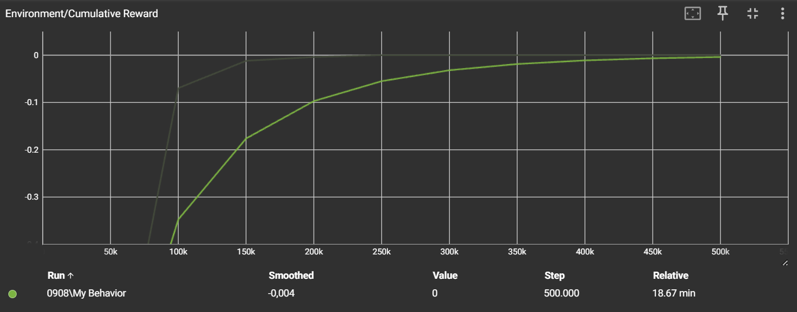

Intermediate rewards were then added, proportional to their height relative to the ground (+1.0, +2.0, +3.0).

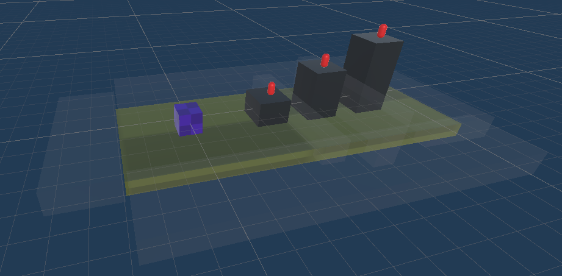

This small addition increased the performance, as the cumulative reward increased to a positive value, though it was still not ideal.

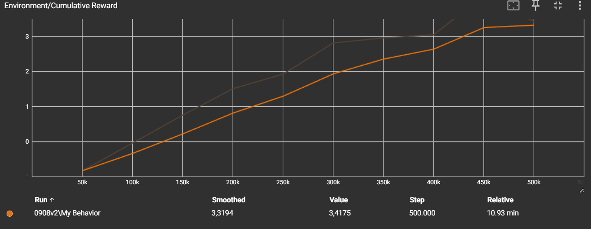

Subsequent iterations were necessary to balance rewards and penalties. Techniques employed in those 12 iterations include:
- Increasing the value of all rewards and final rewards
- Adjusting constant and terminal penalties
- Extending the maximum training steps
- Reducing episode duration
- Introducing additional penalties for each movement
- Disabling rewards once collected
- Enlarging the observation space
- Modifying model hyperparameters (such as learning rate and beta)
- Randomizing the starting position of the agent

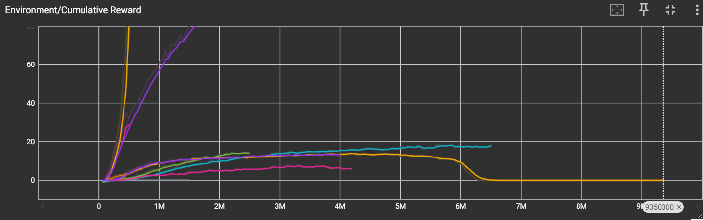

## Final Settings and Results

In the final version of the environment, rewards are exponentially increasing (+2.77, +8.00, +24.29), penalty per movement is -0.0001, and terminal penalty for colliding with a wall is -0.05. The agent starts at a random position within a specified area at each episode.

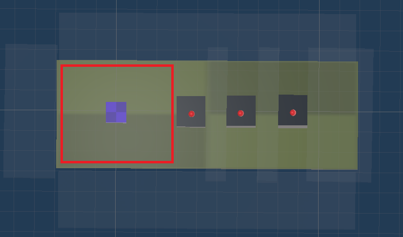

This configuration, combined with the added randomness, resulted in relatively successful training, yielding reliable results and preventing overfitting.

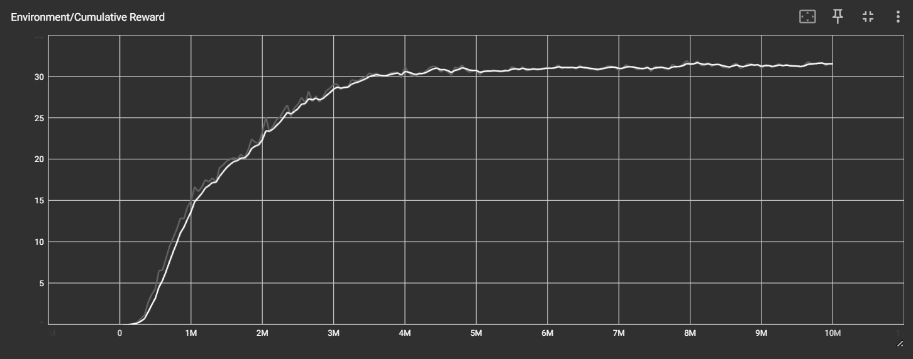

From the graph, it can be seen that the reward value converged to 30 points, which is in-line with the results acquired in the Unity environment, using the trained neural network. These results show that from 11,065 agents, 10,701 of them managed to reach the 3rd goal, which corresponds to a 96.7% success rate. As a side note, the model discovered a strategy for reaching the third goal without obtaining the second goal and demonstrated this capability in approximately 2,500 episodes.

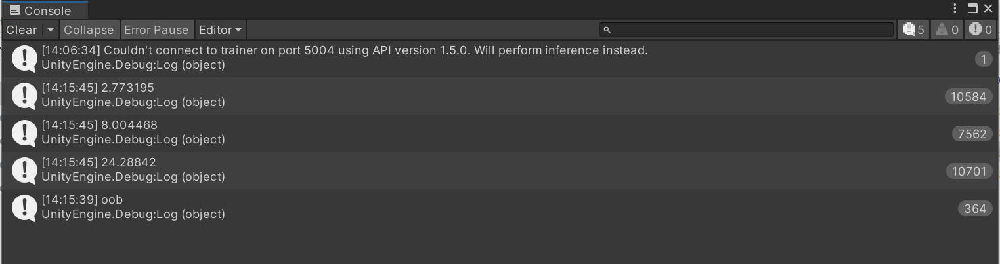

Due to the stochastic nature of the training, the results may vary even with the identical environment and hyperparameters. Below graphs are aimed to demonstrate this phenomenon.

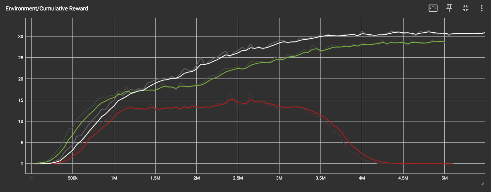
